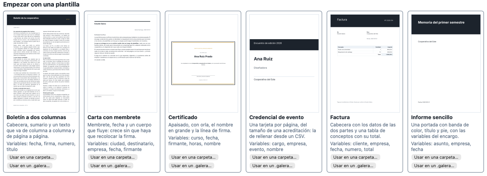
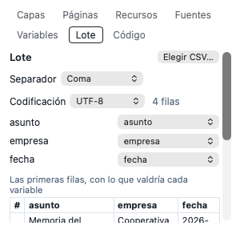

# Plantillas, variables y lotes

Un documento con huecos que se rellenan, y muchos documentos a la vez desde
una hoja de cálculo: diplomas, credenciales, cartas, facturas.

## Las plantillas

Al abrir Galera sin nada, **«Empezar con una plantilla»** enseña las que
trae:

| Plantilla | Qué es |
|---|---|
| **Informe sencillo** | Una portada con banda de color, título y pie, con las variables del encargo |
| **Carta con membrete** | Membrete, fecha y un cuerpo que fluye: crece sin que haya que recolocar la firma |
| **Factura** | Cabecera con los datos de las dos partes y una tabla de conceptos con su total |
| **Certificado** | Apaisado, con orla, el nombre en grande y la línea de firma |
| **Credencial de evento** | Una tarjeta por página, del tamaño de una acreditación: la de rellenar desde un CSV |
| **Boletín a dos columnas** | Cabecera, sumario y un texto que va de columna a columna y de página a página |

Cada tarjeta dice qué variables trae. **«Usar en una carpeta…»** o **«Usar
en un .galera…»** crea un proyecto nuevo a partir de ella. El proyecto es
una copia: puedes cambiarlo todo sin tocar la plantilla.

## Las variables

En la pestaña **«Variables»** están las del documento, cada una con su tipo
y su valor.

- **Añadir una**: «Añadir…», escribe el nombre y elige el tipo: «Texto»,
  «Número», «Fecha» (AAAA-MM-DD) o «Imagen» (la clave de un recurso).
- **Usarla en un texto**: escribe `{{` mientras editas y elige la variable
  de la lista, o pulsa «Insertar» junto a la variable. Aparece como una
  ficha, que se mueve y se borra entera.
- **Cambiar su valor**: en su fila. El documento se actualiza en todos los
  sitios donde está.
- **Renombrarla**: doble clic en el nombre. Se renombra en todos los textos
  que la usan.
- **Quitarla**: `×`. Si algún texto la usa, Galera pregunta antes.

Debajo de cada variable pone dónde se usa: «Sin usar en el documento» o «Se
usa en N elementos».

Si una variable se queda **sin valor**, el documento avisa en la barra de
estado, y en el PDF sale el hueco vacío.

## Generar en lote

La pestaña **«Lote»** hace **un documento por fila de una hoja de cálculo**:
cien credenciales desde la lista de inscritos, un diploma por alumno.

1. **Prepara la hoja** con una fila por documento y una columna por
   variable, y guárdala como **CSV** (en Excel o Numbers: «Guardar como» →
   CSV). La primera fila son los nombres de las columnas.
2. **«Elegir CSV…»**. Galera adivina el separador. Si aun así los acentos
   salen mal o las columnas no se separan, cambia el «Separador» (coma,
   punto y coma, tabulador o barra) o la «Codificación» (UTF-8 o
   ISO-8859-1): Excel en español suele guardar con punto y coma.
3. **Relaciona las columnas** con las variables: cada variable, con la
   columna de donde sale. Las que se llaman igual se relacionan solas.
4. **Revisa la vista previa**: las primeras filas, con lo que valdría cada
   variable. Una celda que no vale para su tipo —una fecha mal escrita, un
   número con letras— sale marcada con ⚠ y lo que falla.
5. **Elige la salida**:
   - **«Un PDF por fila»**, con el nombre de cada archivo hecho con las
     variables (por defecto, la primera: `{{nombre}}.pdf`), en la carpeta
     que elijas;
   - o **«Un solo PDF con todas»**, uno detrás de otro.
6. **«Generar»**. Se ve el avance («Generando… 37 de 120») y se puede
   cancelar. Al terminar dice cuántos salieron y, si alguna fila falló, cuál
   y por qué. Las demás salen igual.

El lote no cambia el documento: los valores de las variables siguen siendo
los que tenían.

## Hacer tu propia plantilla

Cualquier documento sirve de plantilla: pon variables donde irán los datos
que cambian y guárdalo. Para hacer uno nuevo parecido, ábrelo y «Guardar
como…» en otro sitio.
