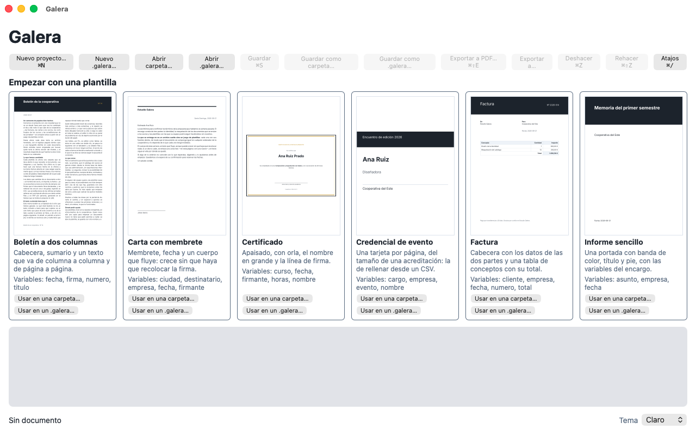
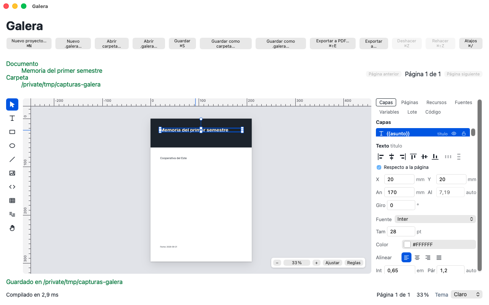
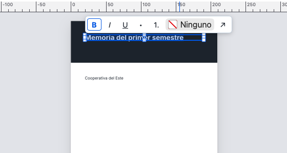
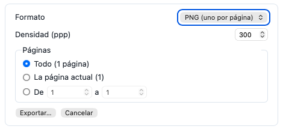

# Primeros pasos

De la instalación al primer PDF, en diez minutos. Se hace un informe a
partir de una plantilla, se cambia el texto, se añade una imagen y se
exporta.

## 1. Instalar

Las descargas están en la página de
[versiones](https://github.com/xlCyanz/galera/releases/latest).

- **macOS** (Apple Silicon e Intel): descarga el `.dmg`, ábrelo y arrastra
  Galera a Aplicaciones. Va firmado y notarizado por Apple: se abre sin
  avisos.
- **Windows** (10 y 11): descarga el instalador `.exe` y ábrelo. Instala
  Galera para tu usuario, sin pedir permisos de administrador. Como todavía
  no va firmado, Windows puede decir que no conoce al editor: pulsa «Más
  información» y «Ejecutar de todas formas».

## 2. Empezar desde una plantilla

Al abrir Galera sin ningún documento aparece **«Empezar con una
plantilla»**: una tarjeta por plantilla, con su vista previa, su descripción
y las variables que trae.

1. En **«Informe sencillo»**, pulsa **«Usar en una carpeta…»**.
2. Elige dónde guardarlo. Galera crea ahí una carpeta con el documento, sus
   fuentes y sus imágenes: el proyecto.

Si prefieres un solo archivo, que se pueda mandar por correo, usa **«Usar en
un .galera…»**. Las diferencias están en
[Conceptos](conceptos.md#proyecto-carpeta-o-galera).

Para empezar en blanco, sin plantilla: **«Nuevo proyecto…»** (`⌘N`). La
página es un A4 vacío.

## 3. La ventana

De arriba abajo y de izquierda a derecha:

- **Los botones de arriba**: nuevo, abrir, guardar, exportar, deshacer y
  rehacer, y «Atajos».
- **Las herramientas**, en la columna de la izquierda: «Selección» (`V`),
  «Texto» (`T`), «Rectángulo» (`R`), «Elipse» (`O`), «Línea» (`L`),
  «Imagen» (`I`), «Bloque de código» (`C`), «Tabla» (`B`), «Zona de texto»
  (`F`) y «Mano» (`H`), para mover la vista.
- **El lienzo**, en el centro: la página tal como saldrá en el PDF. Abajo a
  la derecha, el zoom y las reglas.
- **Los paneles**, a la derecha, en pestañas: «Capas», «Páginas»,
  «Recursos», «Fuentes», «Variables», «Lote» y «Código».
- **El inspector**, debajo de los paneles: las propiedades de lo que esté
  seleccionado.
- **La barra de estado**, abajo del todo: si el documento compila, cuántos
  errores y avisos hay, la página, el zoom y el tema (claro u oscuro).

## 4. Cambiar el texto

1. Haz doble clic en el título de la portada. Aparece el cursor.
2. Escribe. El texto se vuelve a componer mientras escribes: lo que ves es
   ya el resultado final.
3. Para dar formato, selecciona un trozo: aparece la barra de formato con
   «Negrita» (`⌘B`), «Cursiva» (`⌘I`), «Subrayado» (`⌘U`), las listas, el
   color y el enlace.
4. `Esc` o un clic fuera, y has terminado.

La fuente, el tamaño, la alineación y el interlineado del bloque entero
están en el **inspector**, con el texto seleccionado.

## 5. Rellenar las variables

La plantilla trae **variables**: huecos como el cliente o la fecha, que en
el texto se ven como una ficha. En la pestaña **«Variables»** está cada una
con su valor. Cambia el valor y el documento se actualiza en todos los
sitios donde se usa.

Más en [Plantillas, variables y lotes](plantillas-y-lotes.md).

## 6. Añadir una imagen

Arrastra una imagen desde el Finder o el Explorador y suéltala sobre la
página. También puedes elegir la herramienta «Imagen» (`I`) y hacer clic
donde quieras ponerla.

Galera **copia** la imagen dentro del proyecto (en `assets/`): si luego
borras o mueves el archivo original, el documento no lo nota.

Para moverla, arrástrala. Para cambiar su tamaño, arrastra una esquina. Con
`⇧` mantiene la proporción. Mientras la mueves, aparecen guías cuando queda
alineada con otros elementos o con la página. Si quieres colocarla sin que
se enganche, mantén `⌘` pulsado.

## 7. Guardar

`⌘S`. El botón «Guardar» lleva un punto (**«Guardar •»**) mientras hay
cambios sin guardar.

Aunque se te olvide, Galera guarda una copia aparte cada poco. Si la app se
cierra de golpe, al volver a abrirla te ofrece **«Recuperar»** lo que no
habías guardado.

## 8. Exportar el PDF

`⌘⇧E`, o el botón **«Exportar a PDF…»**, y elige dónde dejarlo.

Para otros formatos está **«Exportar a…»**: PDF, SVG o PNG (un archivo por
página, con la densidad que elijas) o el código Typst. Puedes exportar todo,
solo la página actual o un rango.

## Y ahora

- [Conceptos](conceptos.md), para entender qué es cada cosa.
- [Atajos de teclado](../atajos.md): se puede hacer todo sin ratón.
- [Preguntas frecuentes](preguntas-frecuentes.md), si algo no sale como
  esperabas.
